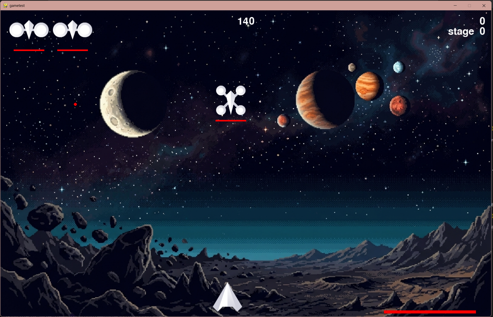
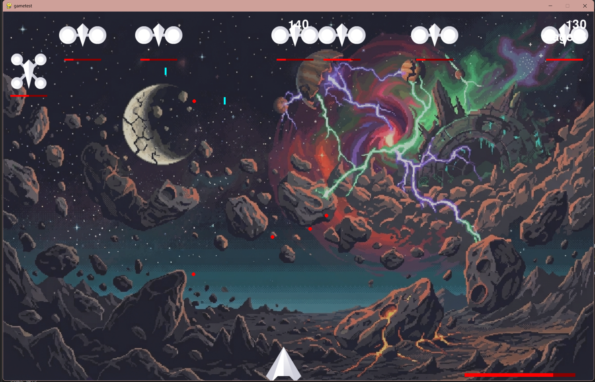
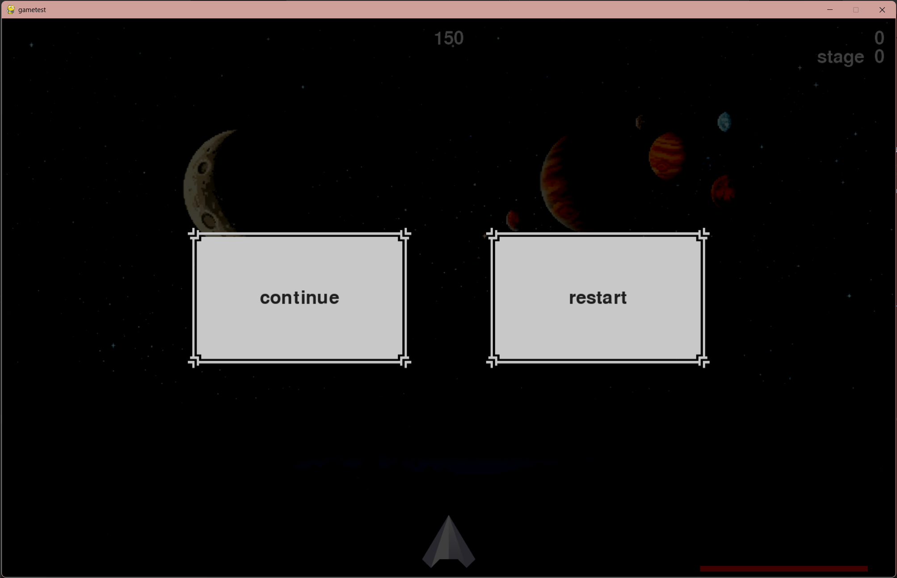

# Alien Invasion

> A 2D shooting game developed with Python and Pygame.





## Overview

Alien Invasion is a 2D shooting game developed with Python and Pygame.
The project is being continuously maintained and developed as a personal
software project.

## Features

- Player movement and shooting
- Multiple enemy types
- Enemy shooting
- Player and enemy health systems
- Collision detection
- Score system
- High-score system(developing)
- Level progression
- Dynamic enemy difficulty
- Pause system
- Interactive buttons

## Screenshots

### Gameplay




### Pause Menu




## Project Structure

```text
Alien_Invation/
├── enemy/
│   ├── aliens
│   └── shooter
│
├── Events/
│   ├── game_events
│   └── hardware_event
│
├── Public/
│   ├── Bullets/
│   │   ├── bullet
│   │   └── homing_bullet
│   ├── button
│   ├── Game_Stats
│   ├── life_bar
│   ├── scoreboard

│   └── settings
│
├── resource/
│   └── Images/
│       ├── Gemini_Generated_Image_u2eywyu2eywyu2ey.png
│       ├── shiip.bmp
│       ├── shiip_1.bmp
│       ├── shiip_2 (2).bmp
│       ├── shiip_2.bmp
│       ├── Shooter.bmp
│       └── Shooter.png
│
├── alien_invasion.py
├── player_ship.py
├── architecture.md
├── DEVELOPE.txt
├── 123123123
└── README.md
```

 
## Tech Stack

- Python
- Pygame
- Git / GitHub

## RoadMap
### Completed
- [x] Pause system
- [x] Enemy shooting system
- [x] Different enemy types
- [x] Player health system (and visibility)
- [x] Score system
- [x] Level system
- [x] Dynamic enemy HP and spawn speed
- [x] Semi-transparent background with smooth transitions
- [x] Restart button
- [x] High score display
- [x] Add game background

### In Progress
- [ ] Improve game UI
- [ ] Refactor project structure
- [ ] Improve code readability
- [ ] Improve difficulty progression


### Planned

- [ ] Add save/load system
- [ ] Add more enemy types
- [ ] Add additional gameplay mechanics


## How to Run
1. Download or clone this repository.
2. Make sure Python and Pygame are installed.
3. Run `alien_invasion.py`.

### Clone

```bash
git clone https://github.com/jun-1e/Aliens-Invation
cd alien-invasion
